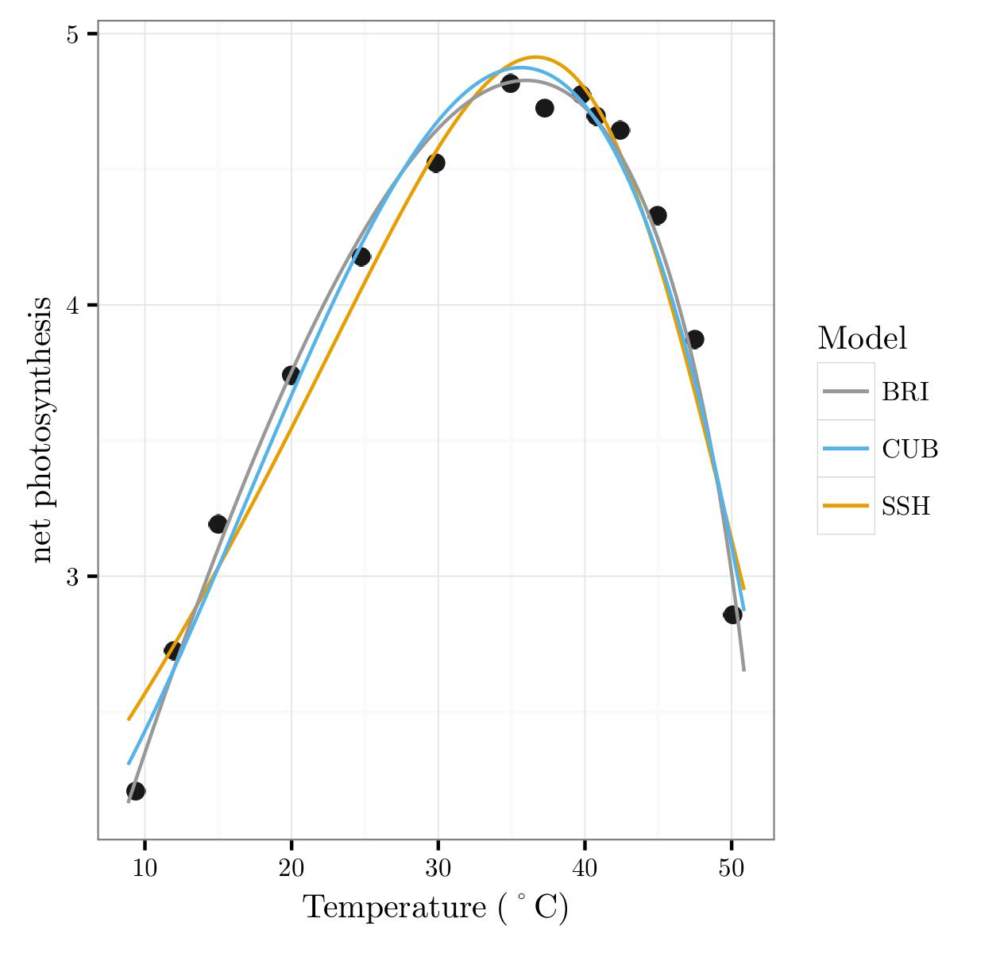

# M.Sc. Computational Methods in Ecology and Evolution (CMEE)
*Author: Luke Joseph Vassor*

This repository contains the source code and data to run the CMEE Miniproject submitted in candidacy of the **Taught M.Sc. CMEE course at Imperial College London**.

Project: Fitting mechanistic and phenomenological models to Thermal Performance Curves (TPCs).

All code in this repository was written in and tested with `Python 3.5.2`, `R 3.2.3`, `Bash 4.3.48` and `LaTeX`.

## Directories & contents
Please do not edit directories or the directory structure as the `Bash` script relies on the structure of the workflow and so the structure must be retained exactly. Please clone entire contents for your own use instead.  
All directories are formatted with the same subdirectory structure in a clean workflow, as follows: 
-- `Code` contains a `Python` script `mini_project_wrangling_fitting.py` to wrangle the data from `BioTraits.csv` and fit 3 models to it and an `R` script `plotting.R` to calculate model comparison statistics and plot the model fits on the data. Lastly contains a `Bash` script to execute the project workflow and produce a pdf project report, written in `LaTeX` (see `Write-Up`). 
The models included are:
* Simplified Schoolfield-Sharpe: A Schoolfield-Sharpe mechanistic model lacking a low temperature correction (1981)
* Briere: A simple phenomenological model which captures nonlinearity at high and low temperatures (1999)
* Cubic Polynomial: A mathematical polynomial function

-- `Data` houses the data which are read into the scripts in `Code`. This is the Global BioTraits Database (Dell et al., 2011). Accessible at: https://biotraits.ucla.edu/  
-- `Results` Any form of script output. The `Python` script produces a `wrangled_data.csv` file here, which is the isolated Thermal Performance Curves which have been accepted by the wrangling code. At then end of the model fitting, the `Python` scripts produces a `model_fitting_results.csv` file here, which includes all parameter estimates and model fit scores for each model on each TPC. Both of these scripts are read in to the `R` plotting script., including, but not limited to, comma-separated files and pdf plots.  
-- `Write-Up` Contains `LaTeX` files used to compile the final pdf project report. In order for citations to be properly embedded into the report by `BibTex`, it is vital that the `.bib` and `.aux` files remains in this directory along with the `.tex` file, as well as the `.toc` file for the Table of Contents to render correctly.  

## Known Issues
* Pandas has columns with multiple data types, this originates from the database and is not a problem.  
* Y-axis labels in R can go out-of-range if longer than plot canvas height. Due to automation of hundreds of plots this could not be fixed as label was stored as variable from imported data. Could implement `if` statement to catch any known, long labels..

## Dependencies
To run this project without error please ensure the following packages and dependencies are insalled prior to running the `Bash` script.  
`Bash` script written in Ubuntu 16.04.  
`Python` script written using `Python 3.5.2`  
Uses: 
* lmfit (0.9.2) - model fitting 
* Numpy (1.16) - mathematical calculations and arrays 
* Scipy (1.2.1) - linear regression 
* Pandas (0.24.1) - data wrangling  
* Matplotlib (1.5.1) - plotting  
* Collections (3.3) - creating ordered dictionaries 
* Datetime (3.2) - timing sthe script 
* Time (3.6) - time limits on parameter estimation 

`R` script written using `R 3.2.3` 
Uses:  
* ggplot2 (3.1.0) - model fit plots 
* tidyr (0.8.3) - data wrangling 
* extrafont (0.13) - LaTeX fonts for plots. Ensure this is installed otherwise poor font quality in figures (won't look like cover image above) 
* xtable (1.8-3) - generating LaTeX code for results tables 

`LaTeX`
Uses:
* geometry - setting margins  
* graphicx - embedding plot graphics 
* amsmath - writing equations  
* lineno - continuous line numbers 
* setspace - manipulating spacing 
* apacite - citation style 
* gensymb - special symbols 
* amssymb - special symbols 
* wrapfig - wrapping figures 

## License

This work is produced for submission in candidacy of the M.Sc. CMEE at Imperial College London. 

---
## For Contributors/Co-authors/Users:

<!-- * Note that the old materials, written in LaTeX, are now in the `archived` directory. -->

* The `Results` directory will be populated only when scripts are run, but these are not version controlled (all files in this directory under `.gitignore`).
* Please do not edit directories or the directory structure as the `Bash` script relies on the structure of the workflow and so the structure must be retained exactly. Please clone entire contents for your own use instead.

## References
Dell,  A.  I.,  Pawar,  S.,  &  Savage,  V.  M.   (2011).   Systematic  variation  in  the  temperature  dependence of physiological and ecological traits.Proceedings  of  the  National  Academy  of  Sciences,108(26),10591–10596.
